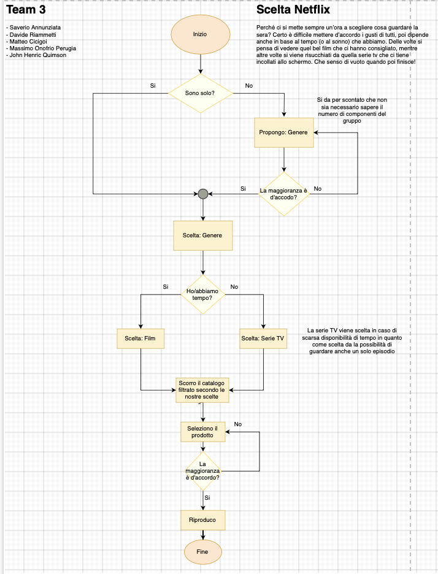

# Algoritmo 

1. Introduzione
2. immagine lavoro

## Introduzione 
questo è stato un progetto in team composto da 5 persone con il compito di creare un algoritmo basato su una richiesta che troverete  nell'immagine.

## immagine di lavoro 

